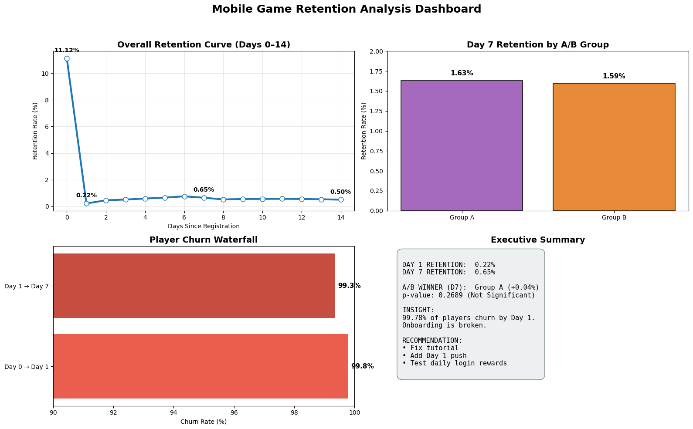

# Mobile Game Retention Analysis

## Project Overview
As a data analysis engineering student, I built this project to practice game analytics skills for Kabam's Game Data Analyst Co-op role. Using the Gamelytics dataset (inspired by F2P mobile games like Marvel Contest of Champions), I analyzed player retention, churn patterns, and A/B test impacts.

**Key Focus**: Calculating Day 1/Day 7 retention, building cohort curves, and creating actionable insights for improving player engagement.

## What I Did
- Loaded and cleaned large event data (1M+ users, 9M+ logins) with pandas.
- Converted Unix timestamps to dates and computed retention rates.
- Performed A/B testing with chi-square stats.
- Visualized results in a dashboard with matplotlib.

## Key Findings
- **Day 1 Retention**: 0.22% (99.78% churn – major onboarding issue).
- **Day 7 Retention**: 0.65%.
- **A/B Insight**: Group A slightly better long-term (not significant).

See the full analysis in the notebook below.

## Dashboard Preview

*(Interactive plots in the notebook show curves and comparisons.)*

## Skills Demonstrated
- Data extraction & manipulation (pandas, like SQL queries).
- Exploratory data analysis (EDA) & cohort modeling.
- Statistical testing (scipy) & visualization (matplotlib/seaborn).
- Insight generation for product teams (e.g., onboarding recommendations).

## How to Run
1. Clone the repo: `git clone https://github.com/yourusername/mobile-game-retention-analysis.git`.
2. Open `Game_Retention_Analysis.ipynb` in Jupyter Notebook.
3. Run cells sequentially (needs Python with pandas, numpy, matplotlib, seaborn).

## What I Learned
This project taught me to handle real-world game data challenges, like deriving retention from timestamps. I'm excited to apply these skills in a co-op and learn from live game metrics!

**Feedback welcome** – open to questions or improvements.

---

*Built by Ganbold Bold | www.linkedin.com/in/ganbold-bold08 | November 2025*
